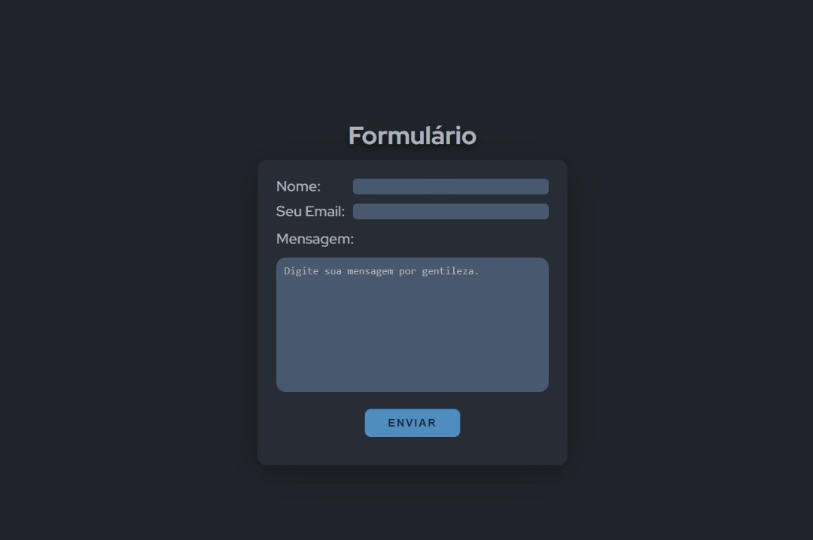

# Formulário de Contato

Este é um projeto de um formulário de contato básico, criado como parte de um desafio proposto por um amigo. O objetivo é criar um site simples com campos para o nome, email e mensagem, e um botão de envio.

### Tecnologias Utilizadas

## Funcionamento
O formulário é composto por três campos: nome, email e mensagem. Todos são obrigatórios para que o envio do formulário seja realizado. Além disso, o campo de email é validado para garantir que o endereço inserido seja válido.

Ao clicar no botão de envio, o formulário é submetido e os dados são enviados para um servidor. Neste projeto, não há um servidor real em funcionamento, mas é possível simular o envio do formulário através de um console.log que exibe os dados inseridos.

## Como Utilizar

 

Para utilizar o formulário, basta acessar a página e preencher os campos com seu nome, email e mensagem. Certifique-se de que todos os campos obrigatórios foram preenchidos corretamente antes de clicar no botão de envio.

Se todos os campos estiverem corretos, uma mensagem de sucesso será exibida na tela, indicando que o formulário foi enviado com sucesso.

## Conclusão
Este é um projeto simples e feito apenas para testar meus conhecimentos com javascript, mas que serve como uma ótima base para futuras melhorias e expansões. Sinta-se livre para utilizar e adaptar o código para suas próprias necessidades!
